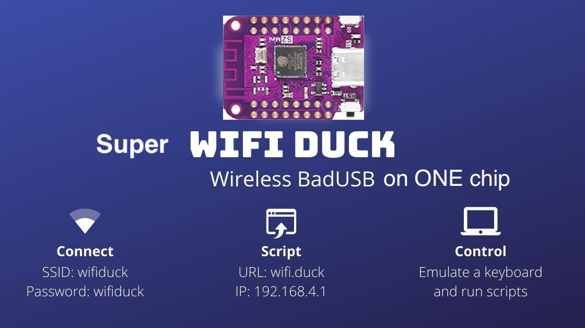

# Super WiFi Duck

<p align="center">

</p>

This project upgrades from WiFi Duck and utilizes the native USB function of ESP32 S2/3 chip. As a result, you can run WiFi Duck with a default module below 10$, and no special hardware work is required.

ESP32 S2/3 can emulate multiple USB devices at the same time. So I want to add USB mouse and USB disk function in the future. But it depends on how much time/money I have.

Please help me to build more projects! [paypal](https://www.paypal.com/donate/?business=UZAK3WFV233ML&no_recurring=0&item_name=Help+me+build+more+project%21&currency_code=USD)

Please read the install and flash parts below. They are different from the original project. 

Want to learn more about BadUSBs? Check out WIFIDuck's online course: [learnbadusb.com](https://learnbadusb.com) 

Video Demo:
<p align="center">

</p>

---

- [Super WiFi Duck](#super-wifi-duck)
  - [About](#about)
  - [Usage](#usage)
  - [Flash ESP32 S2/S3](#flash-esp32-s2s3)
  - [Scripting](#scripting)
    - [Basics](#basics)
    - [Functions](#functions)
    - [Standard Keys](#standard-keys)
    - [Modifier Keys](#modifier-keys)
    - [Other Keys](#other-keys)
    - [Numpad Keys](#numpad-keys)
    - [Examples](#examples)
  - [CLI Commands](#cli-commands)
    - [General](#general)
    - [SPIFFS File Management](#spiffs-file-management)
  - [How to Debug](#how-to-debug)
  - [Development](#development)
    - [Edit Web Files](#edit-web-files)
    - [Translate Keyboard Layout](#translate-keyboard-layout)
  - [Disclaimer](#disclaimer)
  - [License](#license)
  - [Credits](#credits)

## About


WiFi Duck: This open-source project aims to provide a user-friendly tool to learn about keystroke injection attacks and 'BadUSBs'.  

By emulating a USB keyboard, tools like this can gain full access to any computer with a USB port in a matter of seconds!  
This is made possible by the fact that keyboards are trusted by computers. You can have full control over a computer with just a keyboard.  
A BadUSB pretends to be a keyboard to the computer to send keystrokes. 
But unlike a human, it can type hundreds of characters per second. 
By using a simple scripting language, it's easy to make BadUSBs type whatever you want. 

With the WiFi Duck, you can simply connect via WiFi to manage all scripts
from within a web interface. This means that, unlike other BadUSBs, you don't need to install an app, log in, compile or copy scripts to an SD card.  

## Usage

<p align="center">
  <a href="https://www.youtube.com/watch?v=sSJuGXd8QRk">
    
    <br>
    <b>Watch the full video</b>
  </a>
</p>

1. Plug in your WiFi Duck
2. Connect to the WiFi network `wifiduck` with the password `wifiduck`
3. Open a browser and visit `192.168.4.1`
4. Write, save and run your first Ducky Script
5. [Recommended] Open `Settings` (top right corner) and update SSID and password

**Help I forgot the password:**
[Flash the ESP32](#flash-esp32), but make sure that you select `Erase Flash: Sketch + WiFi Settings`
under Tools in the Arduino IDE.  

If you have further questions, check out the [issue section](https://github.com/spacehuhn/WiFiDuck/issues).  

## Flash ESP32 S2/S3

1. Install PlatformIO
2. modify platformio.ini if needed
3. `pio run -e esp32-s3-devkitc-1 -t upload` for esp32s3 ; 
   `pio run -e esp32-s2-kaluga-1 -t upload` for esp32s2

4. see Usage part   

## Scripting

### Basics

Keys are separated by a single space.  
Everything written in a single line gets pressed and released at the same time.  
To write text, use the STRING function.  
It's compatible to Ducky Script, which was developed by the wonderful people at [Hak5](https://www.hak5.org/).  

| Example | Explanation |
| ------- | ----------- |
| WINDOWS <br> r | Type the Windows key and then the r key |
| WINDOWS r | Press the Windows key and the r key simultaneously |
| STRING WINDOWS r | Write WINDOWS r |

### Functions

| Command | Example | Description |
| ------- | ------- | ----------- |
| `REM` | `REM Hello World!` |Comment |
| `DEFAULTDELAY` or `DEFAULT_DELAY` | `DEFAULTDELAY 200` | Time in ms between every command |
| `DELAY` | `DELAY 1000` | Delay in ms |
| `STRING` | `STRING Hello World!` | Types the following string |
| `REPEAT` or `REPLAY` | `REPEAT 3` | Repeats the last command n times |
| `LOCALE` | `LOCALE DE` | Sets the keyboard layout. [List](#translate-keyboard-layout) |
| `KEYCODE` | `KEYCODE 0x02 0x04` | Types a specific key code (modifier, key1[, ..., key6]) in decimal or hexadecimal |
| `LED` | `LED 40 20 10` |Changes the color of the LED in decimal RGB values (0-255) |

### Standard Keys

| Key |
| --- |
| `a` - `z` |
| `A` - `Z` |
| `0` - `9` |
| `F1` - `F12` |

### Modifier Keys

| Key |
| --- |
| `CTRL` or `CONTROL` |
| `SHIFT` |
| `ALT` |
| `WINDOWS` or `GUI` |

### Other Keys

| Key |
| --- |
| `ENTER` |
| `MENU` or `APP`|
| `DELETE` |
| `HOME` |
| `INSERT` |
| `PAGEUP` |
| `PAGEDOWN` |
| `UP` or `UPARROW` |
| `DOWN` or `DOWNARROW` |
| `LEFT` or `LEFTARROW` |
| `RIGHT` or `RIGHTARROW` |
| `TAB` |
| `END` |
| `ESC` or `ESCAPE` |
| `SPACE` |
| `PAUSE or BREAK` |
| `CAPSLOCK` |
| `NUMLOCK` |
| `PRINTSCREEN` |
| `SCROLLLOCK` |

### Numpad Keys

| Key |
| --- |
| `NUM_0` - `NUM_9` |
| `NUM_ASTERIX` |
| `NUM_ENTER` |
| `NUM_MINUS` |
| `NUM_DOT` |
| `NUM_PLUS` |

### Examples

```
REM Hello World for Windows PCs
DEFAULTDELAY 200
GUI r
STRING notepad
ENTER
STRING Hello World!
```

## CLI Commands

The command line interface or CLI is accessible using a serial connection to the ESP8266 (115200 baud, Newline ending) or via the web interface at `192.168.4.1/terminal.html`.  

### General

| Command | Description | Example |
| ------- | ----------- | ------- |
| help | Returns all available commands | `help` |
| ram | Returns available memory in bytes | `ram` |
| version | Returns version number | `version` |
| settings | Returns list of settings | `settings` |
| set -n/ame <value> -v/alue <value> | Sets value of a specific setting | `set ssid "why fight duck"` |
| reset | Resets all settings to their default values | `reset` |
| status | Returns status of i2c connection with Atmega32u4 | `status` |
| run <...> | Starts executing a Ducky script | `run example.txt` |
| stop <...> | Stops executing a Ducky script | `stop example.txt` |

### SPIFFS File Management

| Command | Description | Example |
| ------- | ----------- | ------- |
| mem | Returns available, used and free memory of SPIFFS in bytes | `mem` |
| format | Formats SPIFFS | `format` |
| ls <...> | Returns list of files | `ls /` |
| create <...> | Creates file | `create example.duck` |
| remove <...> | Deletes file | `remove example.duck` |
| cat <...> | Returns content of file | `cat example.duck` |
| rename -fileA,a <value> -fileB,b <value> | Renames file | `rename example.duck example.txt` |
| write -f/ile <value> -c/ontent <value> | Writes (appends) data to file | `write example.txt "Hello World!"` |
| stream <...> | Opens file stream | `stream example.txt` |
| close | Closes file stream | `close` |
| read | Read and return the result from file stream | `read` |

If a stream is open, everything you type (except messages containing exactly `close` or `read`) will be written to the file until you type `close`!  

## How to Debug
The original debug module doesn't work right now.
To debug, please use `ESP_LOGE` to display information via the COM port

## Development

### Edit Web Files

If you would like to modify the web interface, you can!  
The `web/` folder contains all `.html`, `.css`, `.js` files.  
You can edit and test them locally as long as you're connected to the WiFi Duck
network thanks to the websocket connection handled by JavaScript in the background.  

To get the new files onto the ESP8266, run `python3 webconverter.py` in the
repository folder.  
It gzips all files inside `web/`, converts them into a hex array
and saves it in `esp_duck/webfiles.h`.  
Now you just need to [flash](#flash-software) the ESP8266 again.  

### Translate Keyboard Layout

Currently supported keyboard layouts:  
- [:de: DE](https://github.com/spacehuhn/WiFiDuck/blob/master/atmega_duck/locale_de.h)
- [:gb: GB](https://github.com/spacehuhn/WiFiDuck/blob/master/atmega_duck/locale_gb.h)
- [:us: US](https://github.com/spacehuhn/WiFiDuck/blob/master/atmega_duck/locale_us.h)
- [:es: ES](https://github.com/spacehuhn/WiFiDuck/blob/master/atmega_duck/locale_es.h)
- [:denmark: DK](https://github.com/spacehuhn/WiFiDuck/blob/master/atmega_duck/locale_dk.h)
- [:ru: RU](https://github.com/spacehuhn/WiFiDuck/blob/master/atmega_duck/locale_ru.h)
- [:fr: FR](https://github.com/spacehuhn/WiFiDuck/blob/master/atmega_duck/locale_fr.h)
- [:belgium: BE](https://github.com/spacehuhn/WiFiDuck/blob/master/atmega_duck/locale_be.h)
- [:portugal: PT](https://github.com/spacehuhn/WiFiDuck/blob/master/atmega_duck/locale_pt.h)
- [:it: IT](https://github.com/spacehuhn/WiFiDuck/blob/master/atmega_duck/locale_it.h)
- [:slovakia: SK](https://github.com/spacehuhn/WiFiDuck/blob/master/atmega_duck/locale_sk.h)
- [:czech_republic: CZ](https://github.com/spacehuhn/WiFiDuck/blob/master/atmega_duck/locale_cz.h)
- [:slovenia: SI](https://github.com/spacehuhn/WiFiDuck/blob/master/atmega_duck/locale_si.h)
- [:bulgaria: BG](https://github.com/spacehuhn/WiFiDuck/blob/master/atmega_duck/locale_bg.h)
- [:canada: CA-FR](https://github.com/spacehuhn/WiFiDuck/blob/master/atmega_duck/locale_cafr.h)
- [:switzerland: CH-DE](https://github.com/spacehuhn/WiFiDuck/blob/master/atmega_duck/locale_chde.h)
- [:switzerland: CH-FR](https://github.com/spacehuhn/WiFiDuck/blob/master/atmega_duck/locale_chfr.h)
- [:hungary: HU](https://github.com/spacehuhn/WiFiDuck/blob/master/atmega_duck/locale_hu.h)

All standard keys are defined in [usb_hid_keys.h](https://github.com/spacehuhn/WiFiDuck/blob/master/atmega_duck/usb_hid_keys.h).  
To translate a keyboard layout, you have to match each character on
your keyboard to the one(s) of a US keyboard.  
This stuff is hard to explain in writing and requires a lot of manual work and testing.  

1. Copy one of the existing layouts files, like [locale_us.h](https://github.com/spacehuhn/WiFiDuck/blob/master/atmega_duck/locale_us.h).  
Preferably one that is close to your keyboard layout, it will save you time!  
2. Add `#include "locale_xx.h"` to the end of the locales.h file.
3. Rename the file and its variables to your language code.
For example:  
`locale_xx.h` -> `locale_de.h`,  
`ascii_xx` -> `ascii_de`,  
`locale_xx` -> `locale_de`,  
`utf8_xx` -> `utf8_de`.  
`combinations_xx` -> `combinations_de`,  
4. Modify the ASCII array.  
The ASCII array has a fixed size. Each row describes a key.
First a modifier key like `KEY_MOD_LSHIFT`, then a character key.
Some ASCII characters can't be typed or don't require a modifier,
that's where you must place `KEY_NONE`.
Check [usb_hid_keys.h](https://github.com/spacehuhn/WiFiDuck/blob/master/atmega_duck/usb_hid_keys.h) for the available keys.  
If multiple modifiers are required, you must use a bitwise OR to connect them: `KEY_MOD_RALT | KEY_MOD_LSHIFT`.  
For example, in [locale_de.h](https://github.com/spacehuhn/WiFiDuck/blob/master/atmega_duck/locale_de.h#L136) `Z` is saved as `KEY_MOD_LSHIFT, KEY_Y`.  
This is because German keyboards use QWERTZ instead of the QWERTY layout
and since the letter is uppercase, shift must be pressed as well.   
Thankfully you don't have to trial and error everything, the Hak5 Community
translated a lot of layouts already [here](https://github.com/hak5darren/USB-Rubber-Ducky/tree/master/Encoder/resources). It's just written in a different syntax. For example, `ASCII_20` (20 in hexadecimal) is the 32th character in our ascii array.  
5. [deprecated] ~~Modify or create the extended ASCII array.  
The extended ASCII array doesn't have a fixed size and is only as long as you make it.
First the character code. For example, [ä](https://theasciicode.com.ar/extended-ascii-code/letter-a-umlaut-diaeresis-a-umlaut-lowercase-ascii-code-132.html) has the index 132, or 84 in hex.
It doesn't use a modifier and sits where the apostrophe key is on a US keyboard:
`0x84, KEY_NONE,       KEY_APOSTROPHE, // ä`.~~  
6. Modify or create the UTF-8 array.  
The UTF-8 array is variable in length, too.  
The first 4 bytes are the character code.  
For example, [Ä](https://www.fileformat.info/info/unicode/char/00c4/index.htm) has the hex code c384 or 0xc3 0x84. The other 2 bytes are not used so we set them to 0.
Because the letter is uppercase, we need to press the shift key and like before, the letter is typed by pressing the same key as the apostrophe key of a US keyboard: `0xc3, 0x84, 0x00, 0x00, KEY_MOD_LSHIFT, KEY_APOSTROPHE, // Ä`.  
7. Edit the hid_locale_t structure.  
If you renamed all variables accordingly, there's nothing left to do.  
8. Go to [duckparser.cpp](https://github.com/spacehuhn/WiFiDuck/blob/master/atmega_duck/duckparser.cpp#L163) at `// LOCALE (-> change keyboard layout)` you can see a bunch of else if statements.
You need to copy one for your layout.  

Before adding GB layout:  
```c
if (compare(w->str, w->len, "US", CASE_SENSETIVE)) {
    keyboard::setLocale(&locale_us);
} else if (compare(w->str, w->len, "DE", CASE_SENSETIVE)) {
    keyboard::setLocale(&locale_de);
}
```

After adding GB layout:
```c
if (compare(w->str, w->len, "US", CASE_SENSETIVE)) {
    keyboard::setLocale(&locale_us);
} else if (compare(w->str, w->len, "DE", CASE_SENSETIVE)) {
    keyboard::setLocale(&locale_de);
} else if (compare(w->str, w->len, "GB", CASE_SENSETIVE)) {
   keyboard::setLocale(&locale_gb);
}
```
9. Test your layout with a Ducky Script that contains all characters of your keyboard. For example:  
```
LOCALE DE
STRING !"#$%&'()*+,-./0123456789:;<=>?@ABCDEFGHIJKLMNOPQRSTUVWXYZ[\]^_abcdefghijklmnopqrstuvwxyz{|}~²³äöüÄÖÜ߀°§`
ENTER
```
10. Add a link to your layout to [README](README.md), to [web/index.html](web/index.html) and please feel free to improve this tutorial to help future translators!
11. [Create a Pull Request](https://help.github.com/en/articles/creating-a-pull-request)

## Disclaimer

This tool is intended to be used for testing, training, and educational purposes only.  
Never use it to do harm or create damage!  

The continuation of this project counts on you!  

## License

This software is licensed under the MIT License.
See the [license file](LICENSE) for details.  

## Credits

Software libraries used in this project:
  - [Arduino](https://www.arduino.cc)
  - [Neopixel Library](https://github.com/adafruit/Adafruit_NeoPixel)
  - [Dotstar Library](https://github.com/adafruit/Adafruit_DotStar)
  - [AVR, ESP8266 & SAMD Arduino Core](https://github.com/spacehuhn/hardware/tree/master/wifiduck)
  - [ESPAsyncTCP](https://github.com/me-no-dev/ESPAsyncTCP)
  - [ESPAsyncWebServer](https://github.com/me-no-dev/ESPAsyncWebServer)
  - [SimpleCLI](https://github.com/spacehuhn/SimpleCLI)

## Support original wifiduck

Hey, do you like this kind of project?  
It took a huge amount of effort to create!  

To make sure we can keep working on free and open-source projects like this,  
**please consider becoming a [:heart: Sponsor](https://github.com/sponsors/spacehuhntech) or support us via [:coffee: Ko-fi](https://ko-fi.com/spacehuhn).**  

Visit [spacehuhn.com](https://spacehuhn.com) to learn more about us. :chicken:

<a href='https://ko-fi.com/G2G75FA4V' target='_blank'></a>
